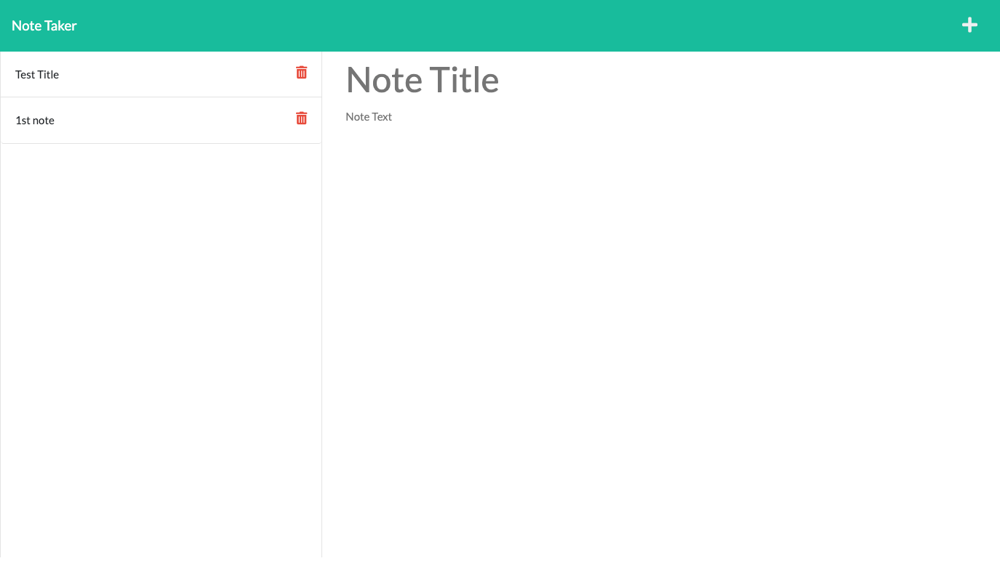

# ExpressNoteTaker (using Node.js//Express) :alien:

[](https://nodejs.org/en/)
[](https://javascript.plainenglish.io)



# Description 
A node.js application using express that uses constructed apis to store data from the user executing the code outside of the browser. Which allows users to make, save, and delete notes and it all happens in real time.  :dizzy: :hole:

For the video walkthrough explaining the application go [here](https://drive.google.com/file/d/1tAzmlk8iGYuyyzwW5KWdq5yCO_NrdATq/view)

## User Story 

```md
AS A small business owner
I WANT to be able to write and save notes
SO THAT I can organize my thoughts and keep track of tasks I need to complete
```

## Acceptance Criteria 
```md
GIVEN a note-taking application
WHEN I open the Note Taker
THEN I am presented with a landing page with a link to a notes page
WHEN I click on the link to the notes page
THEN I am presented with a page with existing notes listed in the left-hand column, plus empty fields to enter a new note title and the note’s text in the right-hand column
WHEN I enter a new note title and the note’s text
THEN a Save icon appears in the navigation at the top of the page
WHEN I click on the Save icon
THEN the new note I have entered is saved and appears in the left-hand column with the other existing notes
WHEN I click on an existing note in the list in the left-hand column
THEN that note appears in the right-hand column
WHEN I click on the Write icon in the navigation at the top of the page
THEN I am presented with empty fields to enter a new note title and the note’s text in the right-hand column
```

## Installation 

Fist off, make sure Node/NPM is installed :green_book:

```md
npm install
```

This will ensure that you have installed all of the proper dependencies for your NPM (node package manager) :new_moon_with_face:

then run 

```md
npm start 
```

to launch the application 

If you'd like a more user friendly approach over the command-line, then you can visit my heroku link [here](https://express-note-taker-jtp.herokuapp.com/notes) :rainbow:


## Contact
[Email](mailto:jamesthomaspatmore7@gmail.com)
</br>
[Github](https://github.com/jamestpatmore)